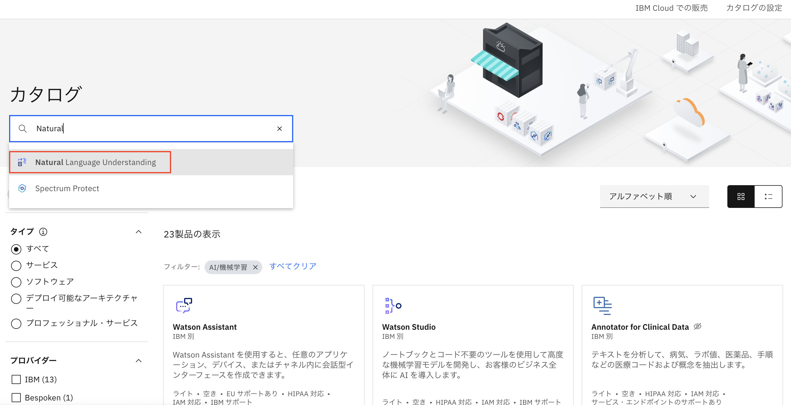
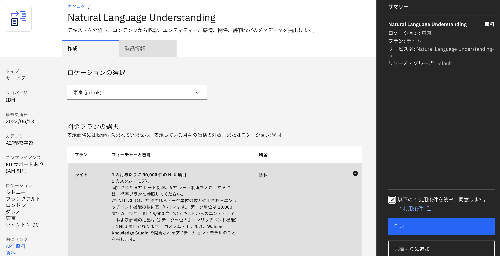
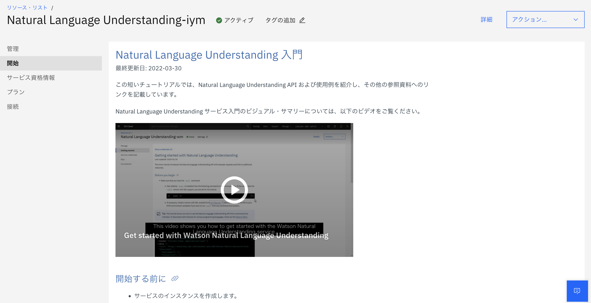
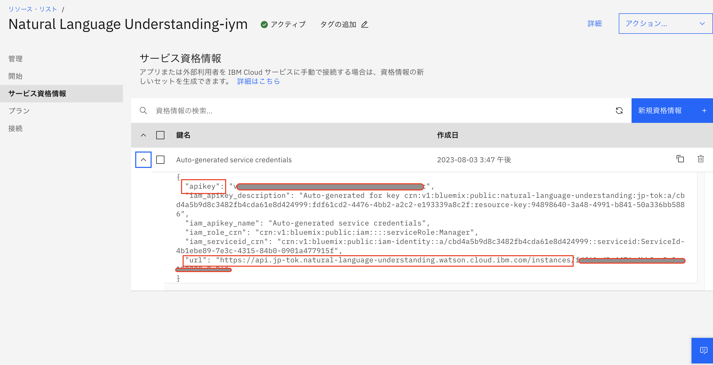
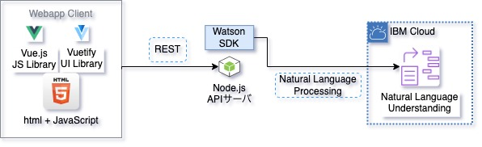
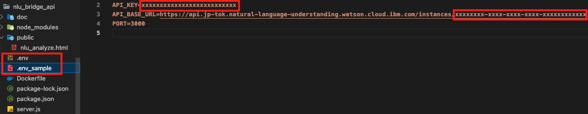
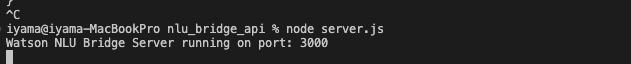
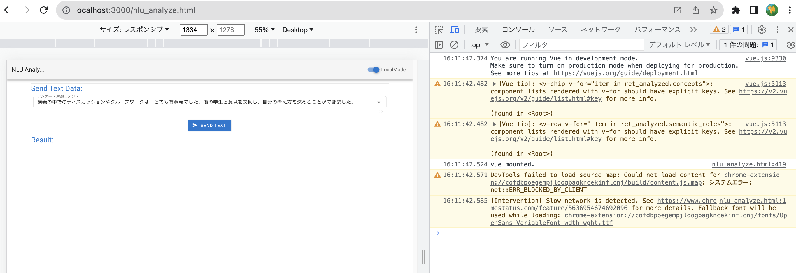
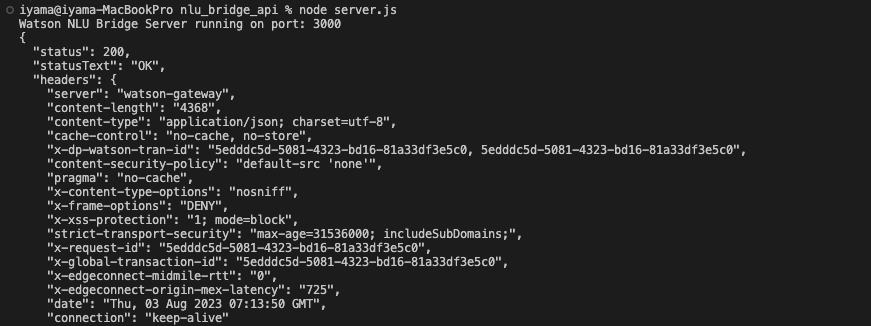
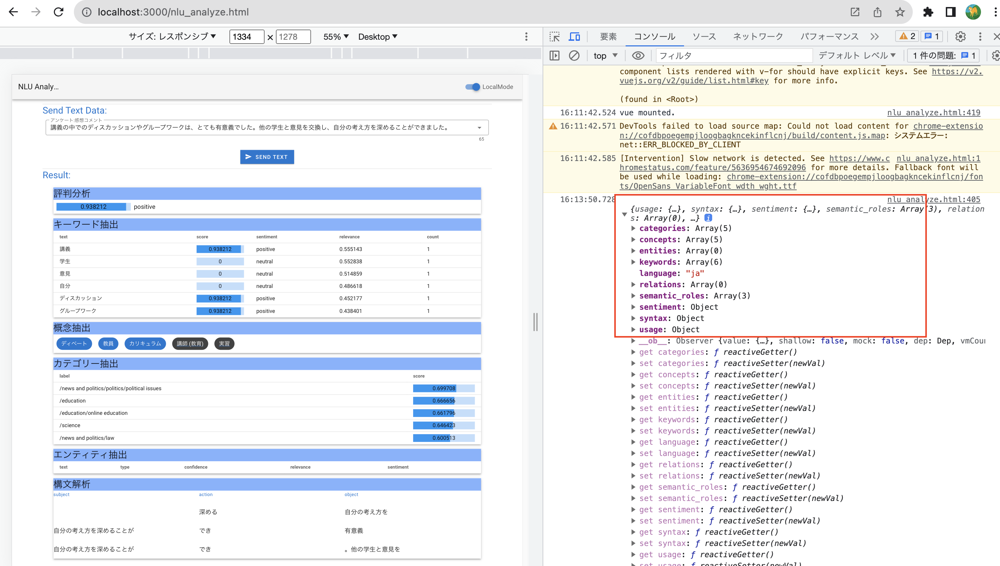

# NLU　Sample　Assets

## IBMCloudからリソースを作成
* "Natural Language Understanding" を検索
  <div>
    
  </div>

* デモ環境では"ライトプラン"を選択
  <div>
    
  </div>

* "ロケーション","サービス名" を決定して「作成」
  <div>
    
  </div>

## IBMCloudのサービス情報
* リソースが作成されるとトップ画面に遷移する
  <div>
    
  </div>
* "サービス資格情報" を開き "apikey","url" をメモしておく
  <div>
    
  </div>

## サンプルアプリ環境概要
  

## 使用しているJavaScriptライブラリ
* [Vue.js](https://jp.vuejs.org/v2/guide/) 2系
* [Vuetify](https://vuetifyjs.com/ja/getting-started/installation/)


## 開発ツールのインストール
* [Node.jsとnvmのインストール](https://kazuhira-r.hatenablog.com/entry/2021/03/22/223042)
  * "node -v", "npm -v" コマンドを確認

## プロジェクトのセットアップ
### ソースのダウンロード
* Gitからソース一式をクローン、or zipファイルダウンドード
```
 "nlu_bridge_api.zip" ファイルを展開
```

### プロジェクトのファイルをインストール
* 展開したソースのディレクトリに "cd"してからインストールを実行
```
"cd ./nlu_bridge_api"
npm install
```
* "package.json"ファイルのあるフォルダ内で上記を実行
* "package.json" 記載のモジュールが "node_modules"配下に展開される


## 開発手順
### NLUのサービス情報をセットする
  * 展開したフォルダ内で ".env_sample"ファイルを ".env"ファイルにコピーする
  * IBMCloudのNLUのサービス情報を貼り付ける
    * apikey, url
      <div>
        
      </div>


### NLUサービスとの中継サーバを起動しコンテンツの動作を確認
```
node server.js
```
* 起動成功で "http://localhost:3000/nlu_analyze.html" でローカルサーバが実行される
  <div>
    
  </div>
* Chromeで上記URLを開いて F12等から デベロッパーツールを開く
  <div>
    
  </div>
* [Send Text]ボタンを押す
  * サーバ側にリクエストが表示される
    <div>
      
    </div>
  * コンテンツ側でレスポンスを確認する
    <div>
      
    </div>
